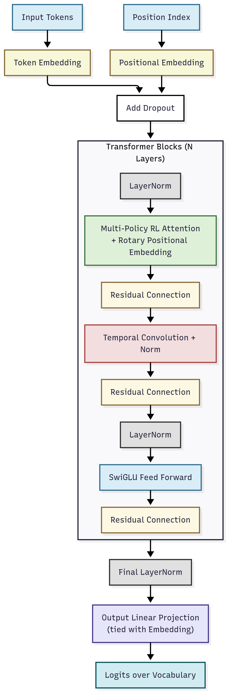

# Reinforcement/Adaptive Transformer (RAT)

  

This is modular implementation of the Reinforcement/Adaptive Transformer or RAT, designed for advanced language modeling tasks.

## Components

- **RotaryPositionEmbedding**: Implements rotary positional encodings for improved attention mechanisms.
- **MultiPolicyRLAttention**: Attention module with multiple RL-based policy networks for dynamic head gating.
- **SwiGLUFeedForward**: Efficient feed-forward network using the SwiGLU activation for better expressiveness.
- **EnhancedRATBlock**: Transformer block combining attention, feed-forward, and temporal convolution layers.
- **EnhancedGPTRAT**: The main transformer model, stacking multiple RAT blocks, with token and position embeddings, and output projection.

---

This README describes only the Transformer architecture. For training, data, and generation utilities, refer to the main project files.
